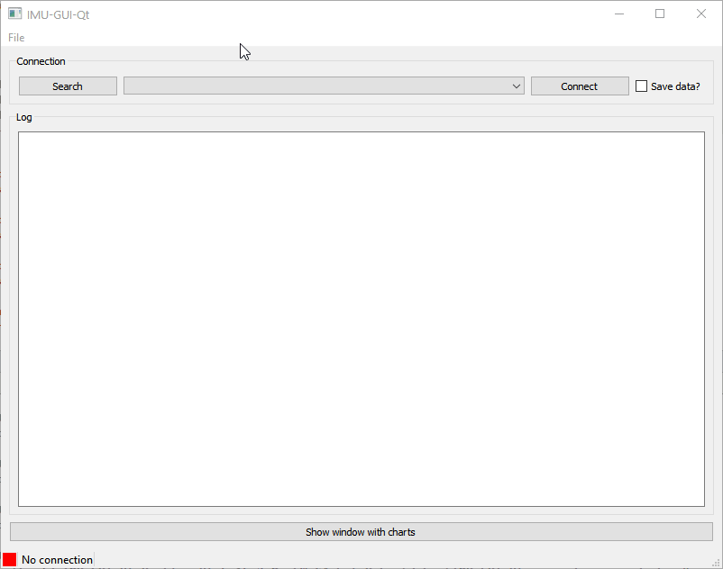
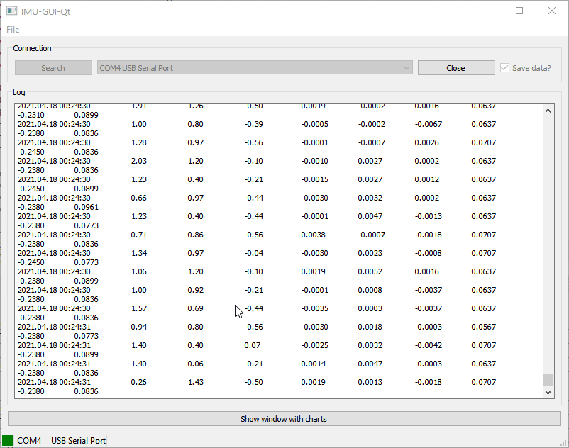

# IMU-GUI-Qt

This is an app, which receives data from a microcontroller STM32F3 Discovery through the serial port.

## Features
- receives data from a microcontroller shows on,
- shows data on charts,
- saves data into a file. 

## Gallery
Main window:

Charts window:
